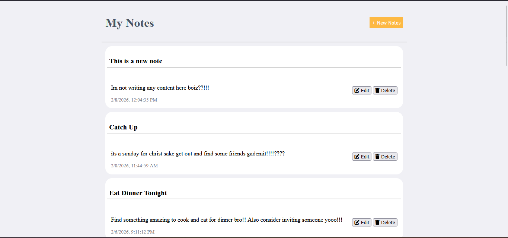
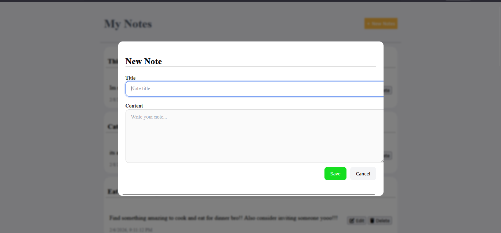

# File‑Based Notes REST API (No Database)

A **full‑stack CRUD notes application** built with **Node.js, Express, and a vanilla HTML/CSS/JS frontend**, using the **file system as the data store instead of a database**.

This project demonstrates:

- Clean backend architecture (routes → controllers → services → utils)
- Safe file persistence with **atomic writes & file locking**
- Full **CRUD REST API** implementation
- Modern frontend UX with **dialogs, optimistic UI updates, and confirmation modals**
- Separation of concerns between **data lifecycle and UI rendering**

---

# Live Concepts Demonstrated

## Backend Engineering

- RESTful API design
- Async file I/O using `fs/promises`
- Atomic write strategy to prevent corruption
- Concurrency safety via file locking
- Centralized error handling middleware
- Environment‑ready project structure

## Frontend Engineering

- Modular vanilla JS architecture
- Fetch API integration
- Dialog‑based Create/Edit UX
- Custom confirmation modal for delete
- Optimistic UI updates
- Loading + error state handling

---

# Project Architecture

```
file-based-rest-api/
│
├── data/                # JSON file persistence layer
├── src/
│   ├── routes/          # Express route definitions
│   ├── controllers/     # Request/response logic
│   ├── services/        # File read/write abstraction
│   ├── utils/           # Atomic write, locking, ID generation
│   ├── middlewares/     # Global error handling
│   ├── config/          # Path configuration
│   ├── app.js           # Express app setup
│   └── server.js        # Entry point
│
├── frontend/            # Vanilla JS UI
│
├── tests/               # API tests (extendable)
├── package.json
└── README.md
```

This mirrors **real production layering**, even without a database.

---

# How It Works

## Data Storage Without a Database

Notes are stored inside:

```
data/notes.json
```

Safety is ensured by:

- **Atomic temp‑file write → rename**
- **File locking during mutations**
- Validation before persistence

This simulates **real database guarantees** using only the file system.

---

# API Endpoints

## Base URL

```
http://127.0.0.1:3000/notes
```

### Get all notes

```
GET /
```

### Create note

```
POST /
```

Body:

```json
{
  "title": "My note",
  "content": "Hello world"
}
```

### Update note

```
PUT /:id
```

### Delete note

```
DELETE /:id
```

---

# Frontend Features

## Notes Dashboard

- Lists all notes
- Shows timestamps
- Instant delete with confirmation modal
- Optimistic UI removal

## Create / Edit Dialog

- Single reusable dialog
- Pre‑filled edit mode
- Form validation
- Auto refresh after save

---

# Key Engineering Decisions

### Why file‑based instead of database?

To **demonstrate deep understanding of persistence mechanics**:

- atomic writes
- concurrency control
- structured architecture

These concepts transfer directly to:

- PostgreSQL
- MongoDB
- Redis
- distributed systems

---

# Getting Started

## 1. Install dependencies

```
npm install
```

## 2. Start backend server

```
npm start
```

Server runs at:

```
http://127.0.0.1:3000
```

## 3. Run frontend

From `/frontend`:

```
npx serve .
```

---

# Future Improvements TODO

- Authentication (JWT)
- Pagination & search
- Markdown note support
- Database migration layer
- Docker deployment
- Cloud storage persistence

---

# Interview Talking Points

## What problem does this solve?

Demonstrates **production‑style backend architecture and data safety** without relying on external databases.

## Hardest engineering challenge solved

Preventing **data corruption during concurrent writes** using:

- atomic temp file strategy
- lock‑based write serialization

## What this proves to employers

- Strong Node.js fundamentals
- Understanding of persistence & concurrency
- Clean architecture thinking
- Full‑stack capability

---

# Author

**Kingori David**

Aspiring **Backend / Full‑Stack Engineer** focused on:

- Node.js systems
- Clean architecture
- Real‑world production patterns

---

**Screenshots**

# Home Page



# Create Note Modal


